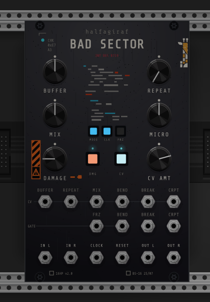

# Bad Sector

**A stereo buffer-corruption and broken-playback processor** for VCV Rack 2, by halfagiraf.

<p align="center">
  
</p>

Bad Sector records continuously into a 64-second ring and, on every clock division,
*acquires* the division that just finished — then mangles that beat-aligned block with
tape failures, digital breakage and media corruption. Every division and Repeat window
uses the same exact rational clock grid, so **playback stays locked no matter how slow,
pitched, reversed or traversed it gets** — a simple melody comes out transformed without
the stutter transients drifting away from the beat.
(The wet path is therefore always one division behind the input; that inherent clocked
delay is the price of the guarantee, and disappears with loop-based material.)

## Controls

- **BUFFER** — the clock. Internal: 16 s – 80 Hz. External: divide/multiply of the CLOCK
  input (/16 /8 /4 /2 ×1 ×2 ×3 ×4 ×8), hard-locked to incoming edges, free-running at the
  last rate when the clock disappears. Accepts audio-rate clocks to ~1 kHz for
  frequency-locked tones.
- **REPEAT** — subdivides each division into *musical* stutter counts only (powers of two
  plus triplets, 1…1024). Rhythm lives in the first half of the travel; audio-rate buzz in
  the top stretch.
- **MIX** — equal-power dry/wet. Wet = the previous clock division.
- **DAMAGE** — one knob, three independently stored channels, cycled by its square
  selector button: **Bend** (cyan), **Break** (amber), **Corrupt** (red-orange). Switching
  channels snaps the knob to that channel's stored value. The dot above the button shows
  the selected channel's level.
  - **Bend** — tape failures, rolled fresh every division: varispeed jumps in octaves and
    two-octave ranges, reverses, beat-length tape stops, subtle wow/flutter and gliding
    speed slews at the top of the range. Higher settings can layer a held 2/3/4/6/8-slot
    reverse-and-pitch gesture over the Repeat grid; both grids use exact beat fractions.
    No synthetic crackle is added to Bend; low windowing can still expose intentional
    hard-edge clicks at slice changes.
  - **Break** — digital failures: subsection jumps, extra repeats (always from the musical
    table), and up to 90 % silence per repeat at the top.
  - **Corrupt** — end-of-chain media damage: **Decimate** (fixed shuffled bit-crush,
    downsample, hiss and drive variations), **Dropout** (the left side of the *knob* gives
    fewer/longer random gaps; the right side gives more/shorter gaps), **Destroy** (soft
    saturation into devastation), **DJ Filter** (low-pass below noon, neutral at noon,
    high-pass above), and **Vinyl Sim** (dust, pops and colouring). The CRPT gate steps
    the effect; a context option limits the list to the original three.
- **CV AMT** — the same three-channel pattern for **bipolar** CV attenuverters
  (centre = no modulation) over the Bend/Break/Corrupt CV inputs.
- **MICRO** — manual playback speed, ±3 octaves. Active in Micro mode (and optionally as
  a global varispeed under Macro via the context menu).
- **MODE / CLK / FRZ** — Macro/Micro, internal/external clock, and Freeze (latching by
  default, engaging on the next division so everything stays in sync).

## Modes

**Macro** — the machine drives: Bend and Break roll new manipulations every clock
division, per-channel when *Stereo: unique* is enabled. Bend and Break start disabled to
match Data Bender's restore defaults; enable them with their latching gates or the two
context-menu switches. Factory presets store their intended enabled states.

**Micro** — you drive: MICRO sets the speed (BEND CV tracks 1 V/oct), the BEND gate
toggles reverse, and the Break channel becomes **Traverse** (select the looping
subsection) or **Silence** (duty cycle, toggled by the BREAK gate). The display shows the
speed with the hardware-style colour code — cyan on an exact octave, green reversed, gold
reversed-on-octave — and blips gold when the traverse subsection changes. Selector
channels that are inactive in the current mode dim to 25 %.

## Timing contract

- Internal Time and all nine external /16…×8 settings acquire on clock boundaries.
- Repeat, Break-added repeats, Traverse changes, synchronized silence, Bend rolls,
  reverse-flutter slots, tape stops, Freeze latching and Reset all resolve from that clock
  grid. Pitch and direction change the content inside a window, never its next retrigger.
- If an external clock vanishes, the learned phase keeps running without a deliberately
  late first free-run beat; a returning edge re-anchors the grid without a near-duplicate
  trigger. The clock LED goes dim after four missing input beats.
- Corrupt is intentionally post-buffer media damage. In particular, Corrupt **Dropout**
  remains random/free-running like the hardware; use Break for synchronized dropout.

## The display

The central checksum artwork is live: data rows fragment with the damage — **cyan**
displacement from Bend, **amber** broken/repeated rows from Break, **red-orange** noise
blocks from Corrupt — and the neon-red readout shows the clock division, current corrupt
effect and a checksum that destabilises as corruption rises.

## Jacks

Three rows on one grid: a CV row (Buffer, Repeat, Mix, Bend, Break, Crpt), a gate row
aligned under the matching CV columns (Frz, Bend, Break, Crpt), and audio I/O with
**CLOCK** and **RESET** centre-bottom. RESET resyncs the internal clock immediately, or
realigns the external division counter on the next beat — patch your sequencer's reset
here so divisions land on your downbeat.

## Factory presets

**Tape Ghost** (haunted one-division echo) · **Skipping CD** (on-grid beat repeater) ·
**Half-Speed Memory** (everything returns an octave down) · **Data Rot** (Destroy) ·
**Underwater Vinyl** (max-Bend slew glides with dropouts) · **Ambient Wash** (fast-grain
shimmer texture).

## Building

```
export RACK_DIR=/path/to/Rack-SDK
make
make install
```

Three unit-test suites live in `tests/` (build each with `g++ -std=c++11 <file> -o test && ./test`):
`timing_test.cpp` validates the repeat grid — the same `BsGrid.hpp` arithmetic the module
runs — against exact rational clock fractions: exact window counts, boundaries within one
sample of the ideal fraction, and safe live Repeat changes, across sample rates and odd
division lengths. `clock_test.cpp` exercises every external division/multiplier, source
loss, late edges, live ratio changes and Reset against the production `BsClock.hpp`.
`selector_test.cpp` covers the three-channel virtual-knob snap recall used by the module.

## License

GPL-3.0-or-later. Panel artwork © halfagiraf. Inspired by hardware media-failure
processors; all DSP is original. Jack graphics derived from a generative render; some
earlier revisions used a resized VCV Component Library jack under its Rack-plugin licence.
